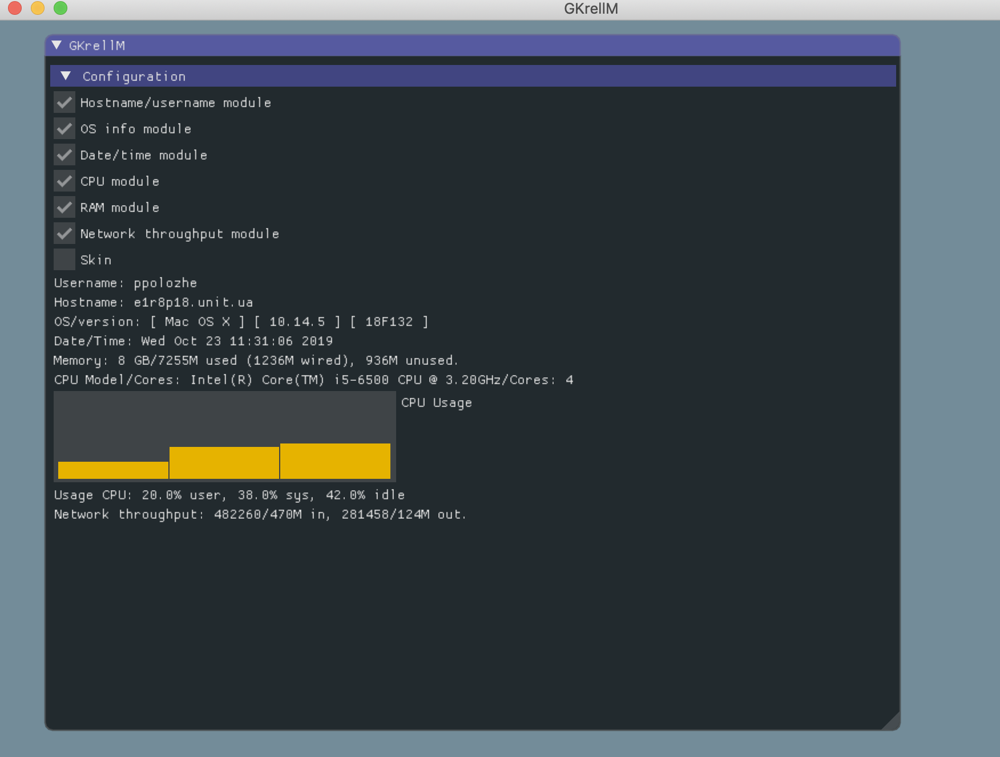
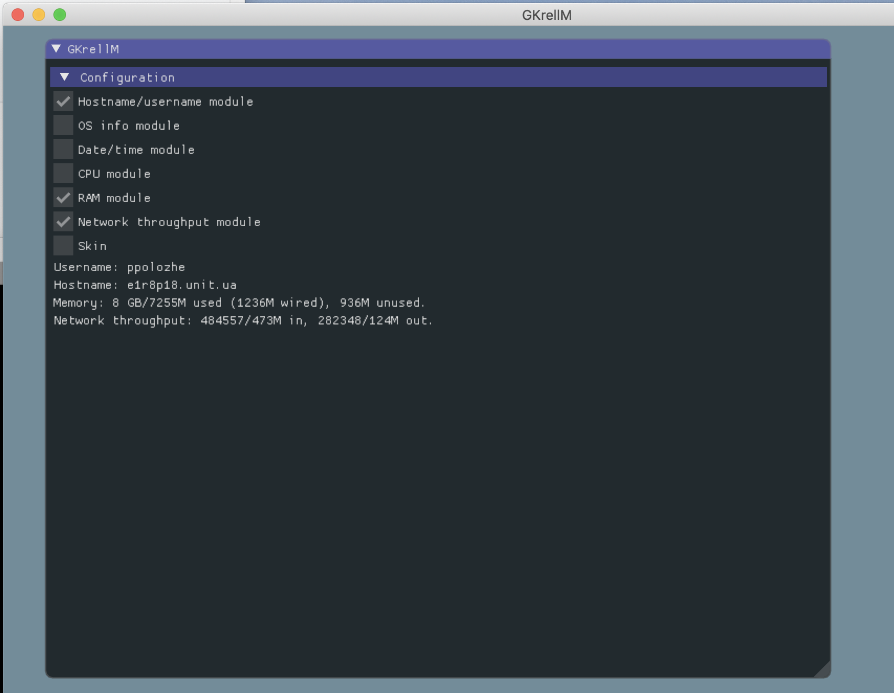
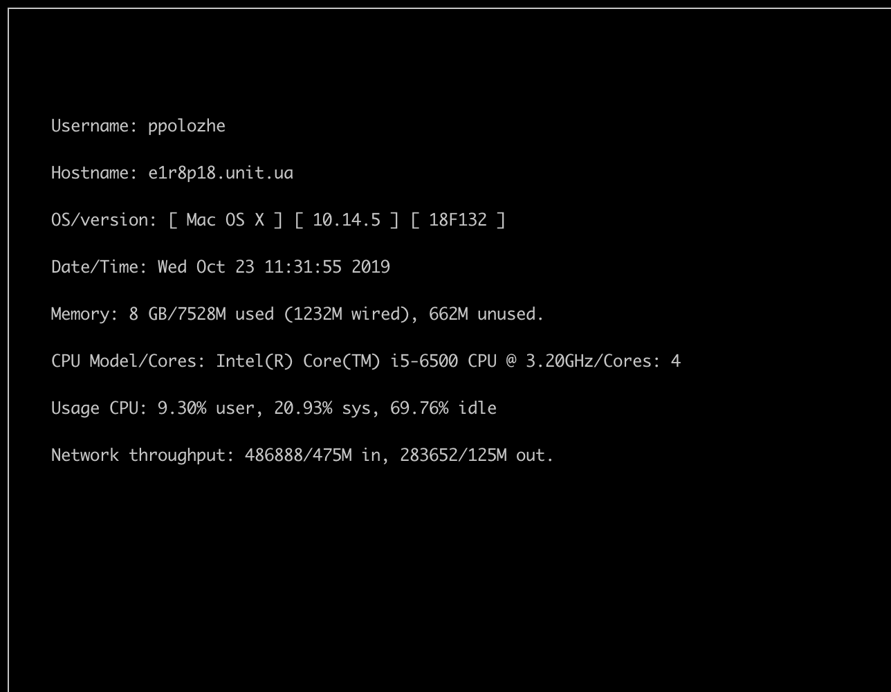
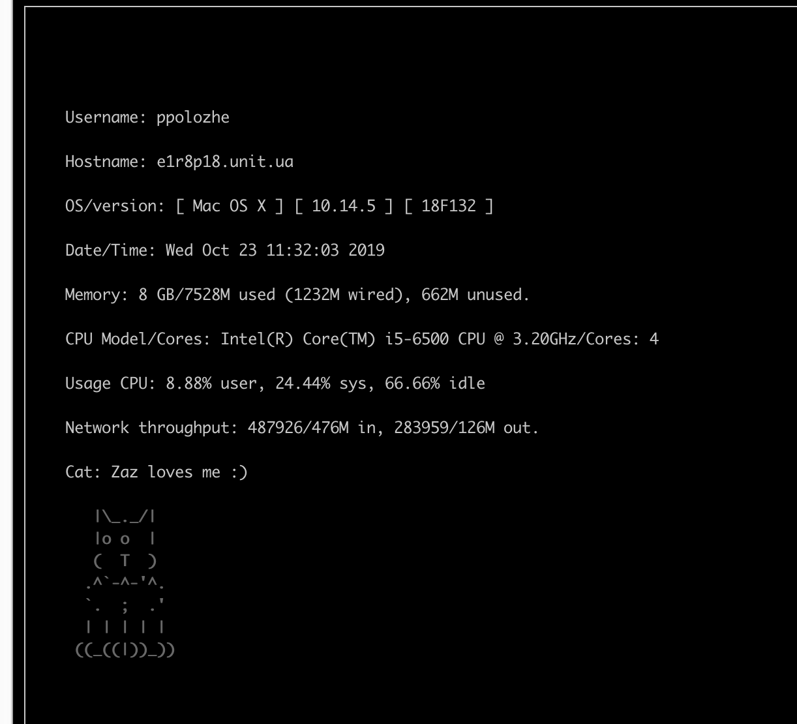

GNU Krell Monitors 
## ft_gkrellm is a system monitor software (C++, ncurces, GUI)





## How to rum

```
git clone https://github.com/past77/ft_gkrellm.git ft_gkrellm && cd ft_gkrellm
make
./ft_gkrellm [cli, gui] 
 
```
cli : show monitor using ucurces <br>
gui : show monitor using gui
